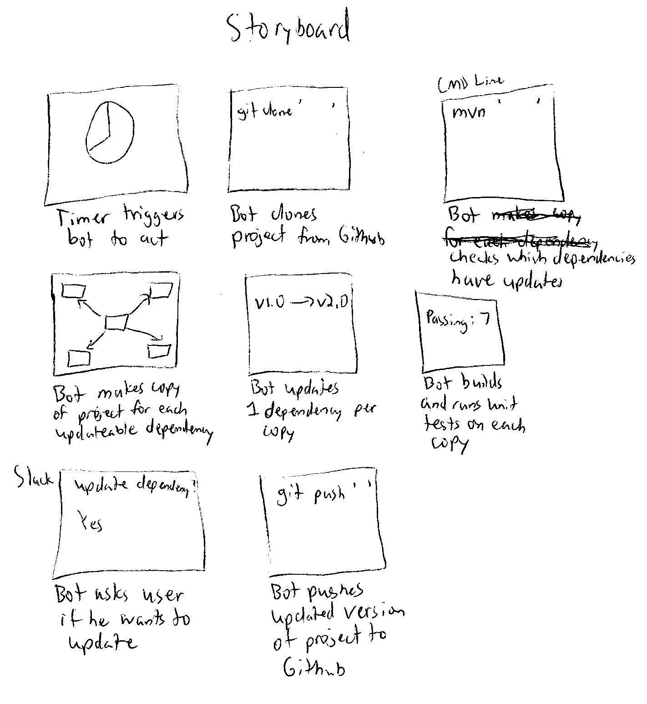

### Problem Statement

A basic fundamental need of software systems which evolve over time is the idea of "designing for failure". The gold standard for software availability is the "5 9's", meaning that the system will be up 99.999% of the time. Most big projects will have dependencies on third-party software. Those third-party software piees will be updated over time, providing gains in performance, security, or reliability, among other things. To ensure your software is as up to date as possible, you will occasionally need to update your software so that it is using the latest version of any software it is dependent on. 

Incompatibility issues can often arise from updating versions of different dependencies in a software project, which leads to needless downtime. When this occurs it can take a long time for developers to dig through every dependency that has been updated, identify the specific one that caused the build to break, and determine what needs to be done to fix it. BuildSlackers automates this process so that not only will developers not need to waste time determining what dependency upgrades caused a build to break, but the build will not even break from dependency incompatibility in the first place.

### Bot Description

BuildSlackers will simplify the process of updating the dependencies of a project through automation. BuildSlackers will operate on a timer. Everytime that timer reaches 0 (be it once a week, a day, etc...) BuildSlackers will clone a Github project. It will then use Maven to find all the dependencies that can be updated. For each dependency that can be updated, it will create a separate copy of the project and update one dependency per copy. After updating a dependency, BuildSlackers will compile the project and run any unit tests, redirecting the build result into log files. All errors and warnings are extracted and placed into separate log files so they may be easily located. Unit tests results will also be saved to a log file. If the build succeeds and all the unit tests pass, BuildSlackers will use Slack to ask a user if they want to update the dependency. If the user says 'yes', BuildSlackers will push the updated version of the project to Github. 

BuildSlackers fits most nicely into the DevOps bot category. A bot is a good solution for this project, because checking for dependency updates with maven is a task that can easily be automated, freeing up developers to work on more complex issues. A bot will reduce the time developers need to spend figuring out if they need to update their dependencies, because they will be notified whenever a dependency can be updated. Having a bot check for dependency updates continuously also means that your project is more likely to stay as up to date as possible. This way, developers will only need to spend time updating a project's dependency version, when the new version of a dependency is incompatible with the current state of the project. 
  
##### Design Documents

###### Wireframe

##### Storyboard

### Architecture Design

Constraints:
- The bot will only fix dependency incompatibility upgrade issues in Java code. If a project has non-Java files that need upgrading, BuildSlackers will not handle that.
- Requires Maven to be installed on the machine the bot is running on.
- Due to time constraints, we will only be looking at checking if an update will break the code on a per dependency basis. That is, if there are 2 dependencies, A and B, both at v1.0 and both with an available update to v2.0, we will only check that Av2.0 works with Bv1.0, and that Bv2.0 works with Av1.0, not that the upgraded versions can work together. That is, we will make no guarantee that version 2.0 of A will work correctly with version 2.0 of B.
- When a user asks the bot to update a dependency, it will update to the latest 'safe' version, where 'safe' means that the project can be built, and it passes the unit tests. If a dependency has 2 'safe' versions, v2.0 and v3.0 that are updates to the current version in the project, a user will not have the option of which version to update to. The bot will always update to v3.0 
- BuildSlackers will only check the dependencies for 1 project at a time. If you want to change which project BuildSlackers checks, you will need to tell it to switch projects.

##### Additional Patterns

##### Notes
Our bot was inspired by ApiMonkey, built by Tanvi Mainkar. ApiMonkey is a dependency tool for C# code which does essentially the same thing as BuildSlackers, only in a different language. It can be found at: https://github.com/alt-code/ApiMonkey
