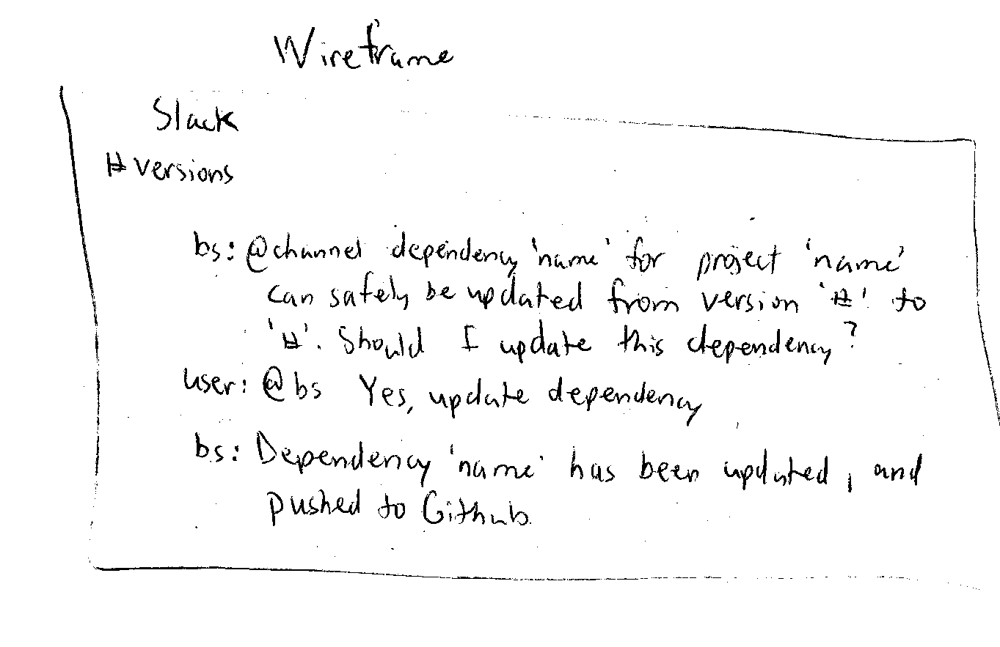
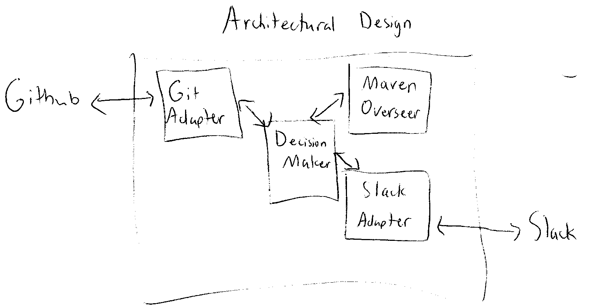

### Problem Statement

A basic fundamental need of software systems which evolve over time is the idea of "designing for failure". The gold standard for software availability is the "5 9's", meaning that the system will be up 99.999% of the time. Most big projects will have dependencies on third-party software. Those third-party software pieces will be updated over time, providing gains in performance, security, or reliability, among other things. To ensure your software is as up to date as possible, you will occasionally need to update your software so that it is using the latest version of any software it is dependent on. 

Incompatibility issues can often arise from updating versions of different dependencies in a software project, which leads to needless downtime. When this occurs it can take a long time for developers to dig through every dependency that has been updated, identify the specific one that caused the build to break, and determine what needs to be done to fix it. BuildSlackers automates this process so that not only will developers not need to waste time determining what dependency upgrades caused a build to break, but the build will not even break from dependency incompatibility in the first place.

### Bot Description

BuildSlackers will simplify the process of updating the dependencies of a project through automation. BuildSlackers will operate on a timer. Everytime that timer reaches 0 (be it once a week, a day, etc...) BuildSlackers will clone a Github project. It will then use Maven to find all the dependencies that can be updated. For each dependency that can be updated, it will create a separate copy of the project and update one dependency per copy. After updating a dependency, BuildSlackers will compile the project and run any unit tests, redirecting the build result into log files. All errors and warnings are extracted and placed into separate log files so they may be easily located. The results of unit tests will also be saved to a log file. If the build succeeds and all the unit tests pass, BuildSlackers will use Slack to ask a user if they want to update the dependency. If the user says 'yes', BuildSlackers will push the updated version of the project to Github. 

BuildSlackers fits most nicely into the DevOps bot category. A bot is a good solution for this project, because checking for dependency updates with maven is a task that can easily be automated, freeing up developers to work on more complex issues. A bot will reduce the time developers need to spend figuring out if they need to update their dependencies, because they will be notified whenever a dependency can be updated. Having a bot check for dependency updates continuously also means that your project is more likely to stay as up to date as possible. This way, developers will only need to spend time updating a project's dependency version when the new version of a dependency is incompatible with the current state of the project. 
  
##### Design Documents

###### Wireframe

##### Storyboard

### Architecture Design

Our Architecture is made up of 4 main components, 3 of them for interacting with outside services, and one central module for overseeing everything, passing data between the other components, and making decisions about what needs to happen next. 

The first module, Git Adapter, is responsible for interfacing with Git, and providing the central Decision Maker with an easy to use API, so the decision maker doesn't need to know about Github's REST API. The Git Adapter is responsible for cloning projects from Github, and pushing projects with updated dependencies back up to Github. It will follow the adapter pattern, allowing the Decision Maker to act as if it was talking to Github. 

The second module, Slack Adapter, is responsible for interfacing with Slack. It will notify the Slack users of any dependencies that can be updated, and tell the Decision Maker whether to update the dependency or not. This is the conversational module of our bot, and will need to be embedded into Slack so it can interact with users. 

The third module, Maven Overseer, is responsible for using Maven to identify dependencies that can be updated, and updating those dependencies, building the updated version of the project, and running any user tests. This will be an observable, alerting the Decision Maker whenever a dependency can be updated, so the Decision Maker can notify the users through the Slack Adapter, and start making preparations to push that code up to Github. 

The main component is the Decision Maker. The Decision Maker binds the other three components together, so that those components do not need to interact with each other, or even know that the other components exist. It is responsible for telling the Git Adapter which project on Github to clone and push to. It also will tell the Slack Adapter when users need to be asked questions, or updated with information, and the Decision Maker will tell the Maven Overseer when to run. The Decision Maker is also responsible for keeping track of the output from the Maven Overseer (output from Maven builds will be stored in log files), so that it can parse the log files and determine what the appropriate next steps are. 

Constraints:
- The bot will only fix dependency incompatibility upgrade issues in Java code. If a project has non-Java files that need upgrading, BuildSlackers will not handle that.
- Requires Maven to be installed on the machine the bot is running on.
- Due to time constraints, we will only be looking at checking if an update will break the code on a per dependency basis. That is, if there are 2 dependencies, A and B, both at v1.0 and both with an available update to v2.0, we will only check that Av2.0 works with Bv1.0, and that Bv2.0 works with Av1.0, not that the upgraded versions can work together. That is, we will make no guarantee that version 2.0 of A will work correctly with version 2.0 of B.
- When a user asks the bot to update a dependency, it will update to the latest 'safe' version, where 'safe' means that the project can be built, and it passes the unit tests. If a dependency has 2 'safe' versions, v2.0 and v3.0 that are updates to the current version in the project, a user will not have the option of which version to update to. The bot will always update to v3.0 
- BuildSlackers will only check the dependencies for 1 project at a time. If you want to change which project BuildSlackers checks, you will need to tell it to switch projects.

##### Additional Patterns
1. Adapter pattern - The adapter pattern allows classes to work together that couldn't otherwise because of incompatible interfaces. For our architecture, our Git Adapter will conform to the adapter pattern, allowing our Decision Making module to interface with Github without knowing about Github's REST API. The Git Adapter will present to the Decision Making module an API that the Decision Maker expects and with which it can interact.
2. Observer pattern - The observer pattern allows one object to notify other objects when it changes state. In our architecture, the Maven Overseer will be an observable, and the Decision Maker and Slack Adapter will be observers. This will allow the Maven Overseer to notify those modules when a project has dependencies that can be updated, allowing the Decision Maker to respond with the appropriate action, and allowing the Slack Adapter to notify users through Slack.

##### Notes
Our bot was inspired by ApiMonkey, built by Tanvi Mainkar. ApiMonkey is a dependency tool for C# code which does essentially the same thing as BuildSlackers, only in a different language. It can be found at: https://github.com/alt-code/ApiMonkey
